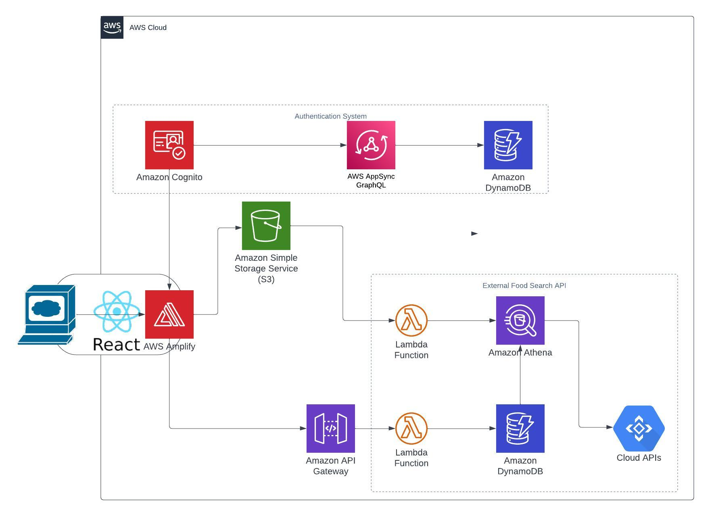

# Final Project: Diet Record App
This project is a Diet Record app built using AWS Amplify and React. Users can create and manage personal body records, view their age, BMI, Body Fat, and create custom foods to add to their daily food intake.

This project was bootstrapped with [Create React App](https://github.com/facebook/create-react-app).

This is the project structure hold on AWS:

## Features
User authentication with AWS Amplify+Cognito
Create and manage personal body records
Calculate age and BMI based on the closest body record
Create and manage custom food items
Add custom food items to daily food intake

## How to Run the app
Please visit the following link for the application through AWS API:

https://main.d3fuok9qvl92xs.amplifyapp.com/

Also please visit the deployment of advanced version(Combined) on my personal web:
https://yuxuanyang.com/health

## How to Run Locally

1. Install Node.js version 16 or later from Node.js website
2. npm install -g @aws-amplify/cli
3. clone the repo
4. cd dietrecord
5. npm install
6. npm start

## Usage
1. Sign up and sign in to the app.
2. Add or update personal body records (height, weight, birthday).
3. View your age and BMI calculated based on the closest body record.
4. Add custom food items with their nutritional information.
5. Edit or delete custom food items.
6. Add custom food items to your daily food intake.
7. Remove food items from your daily food intake.

